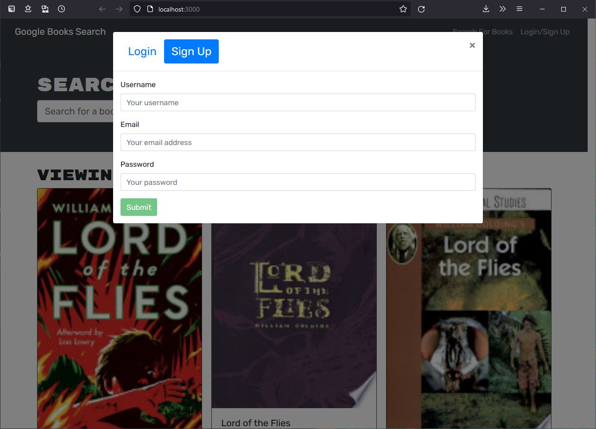

# Book_Search_Engine
[](https://opensource.org/licenses/MIT)

## Description <br>
The app is a book search engine using google books api. Users can then save the books they search for. The application front end is writted using react. The backend utilizes graphql and apollo.
<br>
[Heroku Deployment Link](https://shielded-cliffs-33531.herokuapp.com/)
## Table of Contents
[Installation](#Installation)<br>
[Usage](#Usage)<br>
[License](#Book_Search_Engine)<br>
[Contributing](#Contributing)<br>
[Bugs](#Bugs)<br>
[Questions](#Questions)<br>
    

## Installation
To install the application first clone the repository to the chosen directory.
- In the project directory run the following command to install the required dependencies:
```
npm install
```
- Next run the following command to build the client
```
npm run build
```
- To start only the server run the following command:
```
npm run server
```
- To run the server and client concurrently use the following command:
```
npm run develop
```

## Usage
Run the server and client concurrently using:
```
npm run develop
```
Users can search for a book



## Contributing
Developers can clone the repository and help fix bugs. Please create github issues and create pull requests for any fixes.


## Bugs
There is an issue with trying to properly deploy the page with heroku. A semi-working client is available to see when using npm run develop, but on heroku there is a mongoose server selection error.


## Questions
If you have any questions about the repo or and solutions to the problems, please open an issue or contact me directly at [Dempoleon@gmail.com](Dempoleon@gmail.com).
You can find more of my work at [Dempleon](https://github.com/Dempleon)


